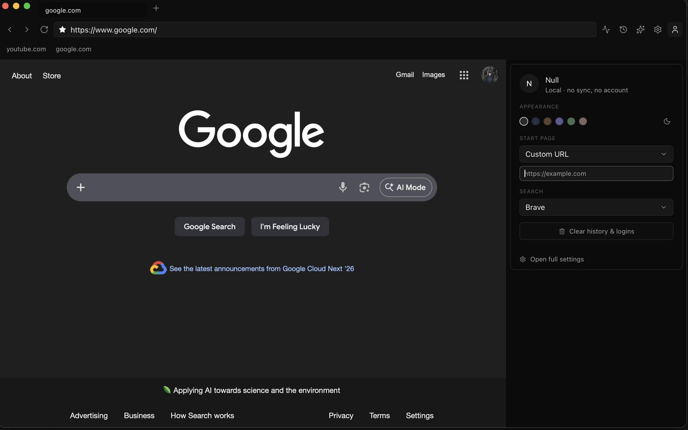
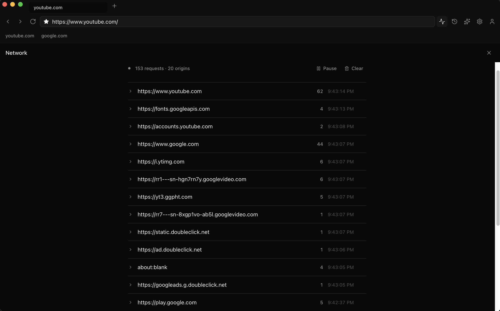

# Null

An open-source web browser where nothing is sent, nothing is stored, nothing is tracked — unless you explicitly choose otherwise.

The name is the thesis: `null` is the value a function returns when there is nothing to return, and that is the correct default for a browser.



<video src="https://github.com/akaieuan/null-browser/raw/HEAD/docs/screenshots/null-browser.webm" controls width="100%"></video>

_[Watch the demo](docs/screenshots/null-browser.webm) — the AI drawer with chat, summarize, search, and save modes running against a live tab._

---

## What is Null?

Null is a macOS desktop browser built on Tauri 2 (Rust) with a React + TypeScript UI. It uses the system WebView (WebKit on macOS), so it renders pages like Safari would — but the browser itself is written with different defaults.

**The thesis:**
1. **Opt-in AI, local-first direction.** The AI drawer has four modes — chat grounded in the current tab, summarize, web search, and save-as-artifact. Cloud providers (Anthropic today) are opt-in per-provider with keys in the OS keychain, and every call is surfaced in the Network Inspector *before* the request leaves. Ollama integration is next so local becomes the default.
2. **Radical transparency.** The Network Inspector is a first-class surface — not buried in devtools. It shows every outbound request the browser makes, in real time, grouped by origin. Click a shield next to any origin to block it.
3. **Assist, don't complete.** The AI is a collaborator, not an agent. It does not click, type, or navigate on your behalf without explicit approval.

There is no account system. There is no sync service. There is no telemetry endpoint. The browser does not phone home on launch, does not check for updates unless you ask, does not ship crash reports anywhere. Your bookmarks, history, AI conversations, and settings live on your machine in SQLite and JSON — inspectable with standard tools.

This is a personal open-source project. There is no business model. There will never be ads, tracking, monetization, or VC capital.

## Why I built this

Every existing browser that calls itself "privacy-focused" still ships its own telemetry, sells a sync subscription, or bolts privacy features onto a business model that depends on my data being legible somewhere else. I wanted a browser that actually let me **reduce, control, and understand my data footprint** — without having to audit the browser itself to find out.

- **Reduce** — the Network Inspector shows every outbound request in real time, grouped by origin. One click on the shield and future requests to that origin are cancelled. You stop hoping the browser isn't talking behind your back and start watching.
- **Control** — the AI drawer is designed to default to a local model running on your own machine via Ollama. Cloud providers (Anthropic today; OpenAI and OpenAI-compatible endpoints scaffolded) are opt-in per-provider, with your own API keys stored in the OS keychain and every cloud call surfaced in the UI before it leaves. The key is yours, the conversations are yours, the bill is yours.
- **Understand** — every piece of state lives in a local SQLite file or localStorage. Bookmarks, history, blocked origins, settings — all inspectable with `sqlite3` or any JSON viewer. Nothing is a remote service you can't open and read.

The AI piece specifically: the modern web is about to route everything through someone else's model, billed to you and observed by them. The bet Null makes is that a modern browser experience should stay **human-driven, not data-driven** — you pick the model, you own the key, the conversations never land on a shared endpoint. Ollama keeps you off the cloud entirely; bring-your-own-Claude/OpenAI keeps you on the cloud only when you've explicitly asked for it. Same tools, same capability, different authority over what leaves your machine.

## The six invariants

These are not defaults — they are invariants. Code that violates them is a bug.

1. **Zero telemetry.** No analytics, no crash reporting to a server, no usage statistics, no A/B testing, no phone-home of any kind.
2. **No default cloud connections.** Null must start up and browse the web without making any connection to a service operated by this project or any third party beyond the site you're visiting.
3. **All AI inference is local by default.** Cloud providers are opt-in, per-provider, per-call.
4. **Every outbound connection is visible** through the Network Inspector.
5. **Data lives with you.** Local, plaintext-inspectable formats (SQLite, JSON). No mandatory sync, no cloud account.
6. **No dark patterns.** No forced onboarding, no engagement retention, no notification spam, no "Skip for now" designed to make the next launch louder.

Read the full reasoning in [docs/PHILOSOPHY.md](docs/PHILOSOPHY.md).

## What's built

### Browsing
- Multi-tab browsing with native `show`/`hide` switching — all tabs stay loaded in memory, no re-render on switch
- Drag to reorder tabs, close with `⌘W`, new tab with `⌘T` or the `+` button
- Back / forward / reload (`⌘[` / `⌘]` / `⌘R`)
- URL bar with search detection — type a URL, press enter to navigate; type anything else, get sent to your chosen search engine
- Custom Safari-compact top bar: tabs in row 1, nav + centered address bar + action buttons in row 2, optional bookmarks bar below

### Bookmarks
- Star inside the URL bar to add/remove the active page
- Bookmarks bar between the toolbar and the content, only visible when you have any
- Drag to reorder; right-click to remove (planned)
- Persisted in SQLite (`bookmarks` table, migration 002 adds positions)

### History
- Every finished page load is recorded to the local `history` table — URL + hostname-derived title + unix timestamp
- `⌘Y` opens the History panel
- Grouped by day (Today / Yesterday / weekday / date), click any entry to navigate
- Remove individual entries, clear all — never synced, never uploaded

### Network Inspector



- `⌘⇧I` opens the panel
- Live stream of every request — main-frame navigations and subresources (scripts, fonts, images, CSS, XHR, fetch)
- Grouped by origin with request counts and timestamps
- Expand any origin to see individual URLs
- **Click the shield icon on any origin to block it.** Future navigations to that origin are cancelled at the webview layer. Subresources to blocked origins still log (marked blocked) so you can see what was refused
- Pause / resume recording, clear all
- Ring buffer capped at 2k events, never persisted (privacy)

### Themes
- Six palettes (Neutral, Slate, Sand, 0400AM, Mudd, Cyberspace) × two modes (light, dark)
- Live preview — switch in the Profile menu or in Settings
- All stored in `localStorage`, applied via CSS custom properties

### Local profile (cosmetic, for now)
- Editable name (defaults to "Null") — appears in the Profile avatar initial
- Quick prefs card: palette swatches, Sun/Moon toggle, start page (Null landing / DuckDuckGo / custom URL), search engine (DuckDuckGo / Brave / Mojeek / Startpage)
- "Open full settings" link into the deeper Settings panel
- Multi-profile switching is not built yet

### Settings panel
- Typography-first layout — section titles and hairline dividers, no card chrome
- **Appearance** — theme + mode
- **Privacy** — read-only status rows reflecting the invariants ("Telemetry: off", "Cloud connections: none", "All data: local")
- **AI** — Anthropic key management + provider status (Ollama detection lands in M5)
- **About** — app version, repo link, one-line tagline

### AI drawer

`⌘/` opens a right-side drawer that narrows the content webview to make room. Four modes, picked from a pill row above the input:

- **Chat** — ask questions about the current tab. The page is extracted once (Mozilla Readability + Turndown), cached for five minutes per tab URL, and sent as context with your question. Single-shot today; conversation history is the next follow-up.
- **Summarize** — extract → AI → save as a `summary` artifact. Optional "focus" field narrows what the summary emphasizes.
- **Search** — runs your query against a SearXNG instance you configure on first use. Nothing ships pre-configured (invariant 2). Results render as clickable cards; no AI call.
- **Save** — extract → save as a `clip` artifact. Zero AI, zero network traffic beyond the page itself.

Artifacts (both `summary` and `clip` rows) get their own view inside the drawer, openable as read-only markdown. They live in SQLite and nothing else.

Every cloud call is recorded to the Network Inspector — `ai:anthropic` for chat and summarize, `search:searxng` for search — *before* the request leaves. Provider keys live in the OS keychain, never in config files. URL query strings are stripped from prompts before they go out so session tokens don't ride along.

Extraction happens inside each tab's own WebView via vendored Readability + Turndown, routed back to Rust through the `null-event://` custom scheme using chunked `Image.src` beacons (not `fetch` — survives strict-CSP sites like Medium, news, docs).

Today: Anthropic for chat/summarize, SearXNG for search. Next: Ollama wired in so local is the default for chat and summarize; Brave Search API as an alternate search provider; conversation history in chat mode.

### Under the hood
- Tauri 2 with the `unstable` feature for multi-webview support
- Rust backend: `tokio`, `rusqlite` (bundled SQLite — no system dep), `directories` (XDG data paths), `tracing` (local logging only), `objc2` + `objc2-app-kit` for macOS-specific tweaks like the dock icon
- Frontend: React 19 + TypeScript + Vite + Tailwind v4 + shadcn primitives + lucide-react icons + dnd-kit for drag reordering + Zustand-ready state management
- Search engines: configurable URL templates — add more by appending to `SEARCH_ENGINES` in `src/lib/preferences.ts`
- UA pinned to current Safari 18 so sites that sniff for Chrome/Safari don't flag WKWebView as "unsupported"

## Keyboard shortcuts

| Shortcut | Action |
|---|---|
| `⌘L` | Focus the URL bar |
| `⌘T` | New tab |
| `⌘W` | Close active tab |
| `⌘R` | Reload |
| `⌘[` | Back |
| `⌘]` | Forward |
| `⌘D` | Toggle bookmark on active page |
| `⌘Y` | Toggle History panel |
| `⌘,` | Toggle Settings panel |
| `⌘⇧I` | Toggle Network Inspector |
| `⌘/` | Toggle AI drawer |
| `Esc` | Close any open panel or drawer |

## Getting started

### Prerequisites
- macOS (primary target; Linux and Windows paths exist but are less tested)
- [Rust stable](https://rustup.rs) — `rustup` is the standard installer
- Node 20+ — nvm or your package manager
- Xcode Command Line Tools on macOS: `xcode-select --install`

Optional:
- [Ollama](https://ollama.com) — for local AI inference (not wired yet; lands in Milestone 5)
- An Anthropic API key — for Chat / Summarize modes in the AI drawer today
- A [SearXNG](https://searxng.org) instance (self-hosted or public) — for Search mode

### Build and run

```sh
git clone https://github.com/akaieuan/null-browser
cd null-browser
npm install
npm run tauri dev
```

First build downloads and compiles ~500 Rust crates + bundled SQLite and takes 3–5 minutes. Subsequent builds are incremental.

### Production build

```sh
npm run tauri build
```

Produces a `.app` bundle in `src-tauri/target/release/bundle/macos/`.

### Where your data lives

All local. On macOS:

```
~/Library/Application Support/sh.null.browser/null.db    — SQLite (bookmarks, history, blocked origins, settings)
~/Library/Caches/sh.null.browser/                        — WebKit cache
localStorage                                              — theme, profile name, start page, search engine
```

To wipe everything: quit Null and `rm -rf ~/Library/Application\ Support/sh.null.browser ~/Library/Caches/sh.null.browser`.

## Repo layout

```
null-browser/
├── src/                          — React + TypeScript UI
│   ├── App.tsx                   — main shell, top bar, state orchestration
│   ├── components/
│   │   ├── panels/               — full-screen overlays (Settings, History, Network, Profile, AI)
│   │   ├── TopProgress.tsx       — the thin progress strip
│   │   └── ui/                   — shadcn primitives
│   └── lib/
│       ├── ipc.ts                — typed wrappers for every Rust command
│       ├── preferences.ts        — local-only prefs (name, start page, search engine)
│       ├── theme.ts              — palette + mode hook
│       └── url.ts                — URL vs query detection
│
├── src-tauri/                    — Rust backend
│   ├── Cargo.toml
│   ├── tauri.conf.json           — window config, bundle identifier (sh.null.browser)
│   └── src/
│       ├── lib.rs                — Tauri builder, command registration, null-event:// URI scheme
│       ├── webview/              — tab webview lifecycle (create, hide, show, navigate, resize)
│       │   ├── extract.rs        — extraction bridge (chunked Image-beacon transport) + per-tab cache
│       │   └── vendor/           — Readability + Turndown, embedded via include_str!
│       ├── network/              — inspector state, navigation + subresource capture, AI/search outbound recording
│       ├── storage/              — SQLite schema (migrations 001–004) + CRUD for bookmarks / history / blocked origins / artifacts / settings
│       ├── commands/             — one file per IPC domain (tabs, bookmarks, history, network, meta, ai, artifacts, search)
│       ├── ai/                   — provider dispatcher + keychain-backed key cache + per-vendor modules (Anthropic wired; Ollama, OpenAI scaffolded)
│       ├── search/               — web search providers (SearXNG today)
│       ├── permissions/          — approval broker (stub)
│       ├── settings/             — versioned JSON config (stub)
│       ├── menu.rs               — native macOS menu with accelerators
│       └── dock.rs               — macOS dock icon via objc2
│
├── docs/
│   ├── PHILOSOPHY.md             — the six invariants and why they exist
│   └── CONTRIBUTING.md           — the three-question PR rule, voice guide, dep audit
│
├── CLAUDE.md                     — project context for Claude Code
├── LICENSE                       — MPL 2.0
└── README.md                     — you are here
```

## Milestones

### Done
- **M0** — scaffolding, licensing, CI
- **M1** — browsing basics (tabs, nav, URL bar, bookmarks, history)
- **M1.5** — bookmarks bar, drag reorder, profile menu, themes
- **M1.6** — top-bar action cluster (History, Chat, Settings, Profile)
- **M2 Phase 1** — Network Inspector with main-frame captures
- **M2 Phase 2** — subresource capture (via injected PerformanceObserver) + per-origin blocking
- **M3** — bring-your-own AI providers (Anthropic, OS-keychain-stored keys, per-call network visibility)
- **M4** — AI drawer with chat (page-grounded), summarize, search (SearXNG), save; artifacts persisted to SQLite

### In progress / next
- **M2 Phase 3** — subresource blocking via `WKContentRuleList` (native WebKit path — objc2 work) and `WKScriptMessageHandler` to close CSP blind spots
- **M5** — Ollama wired into chat and summarize so local is the default; conversation history; Brave Search alternate provider
- **Favicons** — fetch once, cache locally, render in tabs and bookmarks
- **Tab persistence** — restore open tabs on relaunch via SQLite
- **Personal search** — FTS5 over history / bookmarks / artifacts so you can search what you've seen, not the whole web

### Not on the roadmap
- Chromium forking (one-person project can't maintain Chromium)
- Cloud account system (violates invariant)
- Sync (violates invariant; may add optional user-owned sync via S3 / WebDAV / Proton in a later milestone)
- Mobile
- Extensions / WebExtensions API

## Contributing

Read [docs/PHILOSOPHY.md](docs/PHILOSOPHY.md) first. If the change you're proposing wouldn't sit comfortably next to those invariants, it probably doesn't belong here — no matter how useful in isolation.

Before opening a PR, read [docs/CONTRIBUTING.md](docs/CONTRIBUTING.md). Every PR that touches networking, storage, or AI routing has to answer three questions in its description:

- What does this **store**?
- What does this **transmit**?
- What does this **remember**?

If a reviewer can't answer those three from the diff alone, the PR isn't ready.

## License

[MPL 2.0](LICENSE). File-level copyleft — good fit for browsers, compatible with mixing into non-copyleft apps while protecting the codebase.

## What Null is not

- Not a Chromium fork. A solo maintainer cannot keep up with Chromium.
- Not a product. It is not funded, not monetised, not for sale, not seeking acquisition.
- Not a competitor to Chrome / Safari / Firefox. It does not need to displace them to matter.
- Not for everyone. It's for people who would rather have control than convenience.
