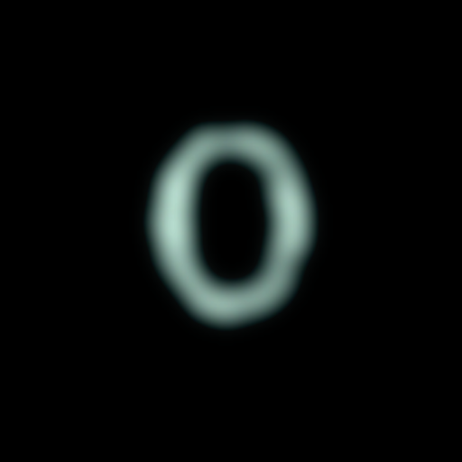
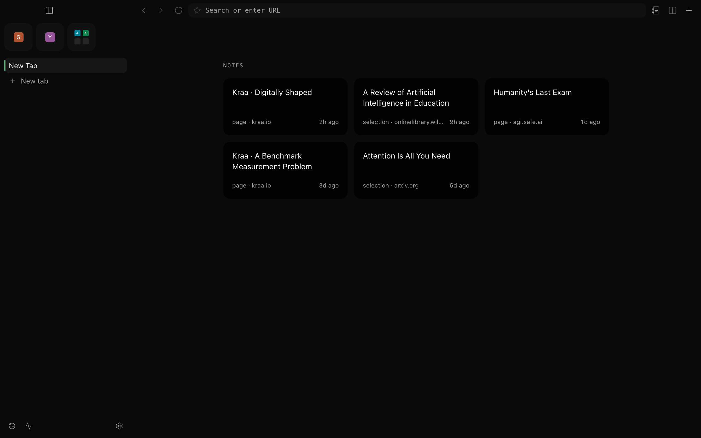
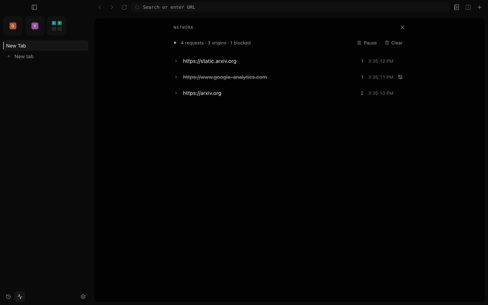
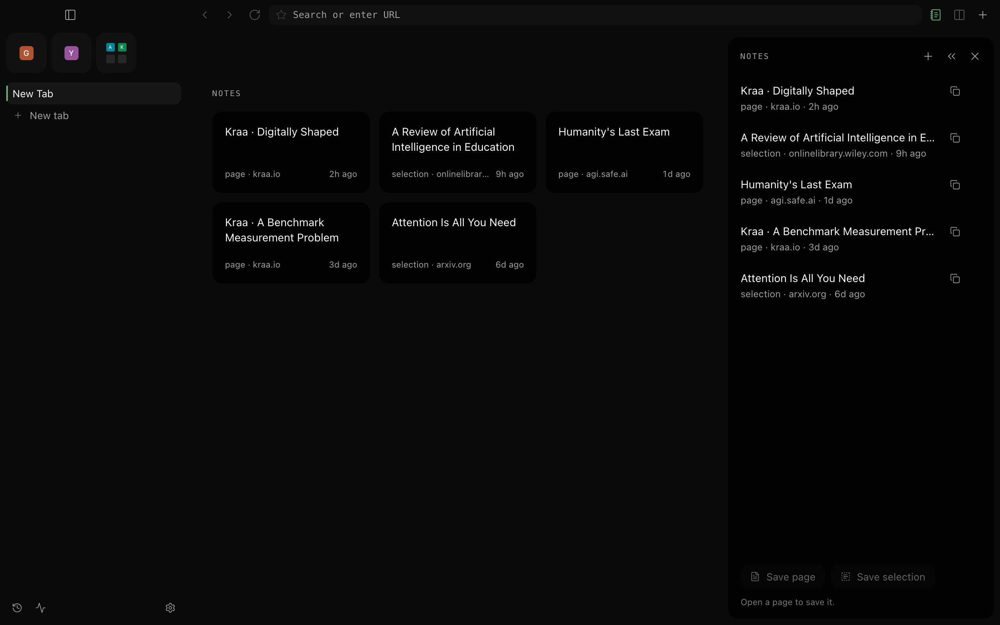

<p align="center"></p>

# Null

An open-source web browser where nothing is sent, nothing is stored, nothing is tracked — unless you explicitly choose otherwise.

The name is the thesis: `null` is the value a function returns when there is nothing to return, and that is the correct default for a browser.



---

## What is Null?

Null is a macOS desktop browser built on Tauri 2 (Rust) with a React + TypeScript UI. It uses the system WebView (WebKit on macOS), so it renders pages like Safari would — but the browser itself is written with different defaults.

**The thesis:**

1. **Capture, don't infer.** Null does not run a language model and does not call one. It captures instead: any page, or any selection, becomes markdown on your disk in one click. Where that markdown goes next — a chat window, an editor, a notes app — is your business, not the browser's.
2. **Radical transparency.** The Network Inspector is a first-class surface, not something buried in devtools. It shows every outbound request the browser makes, in real time, grouped by origin. Click a shield next to any origin to block it.
3. **Assist, don't complete.** Null hands you material and gets out of the way. It does not click, type, or navigate on your behalf.

There is no account system. There is no sync service. There is no telemetry endpoint. The browser does not phone home on launch, does not check for updates unless you ask, does not ship crash reports anywhere. Your bookmarks, history, clips, and settings live on your machine in SQLite, plain markdown, and localStorage — inspectable with standard tools.

This is a personal open-source project. There is no business model. There will never be ads, tracking, monetization, or VC capital.

## Why I built this

Every existing browser that calls itself "privacy-focused" still ships its own telemetry, sells a sync subscription, or bolts privacy features onto a business model that depends on my data being legible somewhere else. I wanted a browser that actually let me **reduce, control, and understand my data footprint** — without having to audit the browser itself to find out.

- **Reduce** — the Network Inspector shows every outbound request in real time, grouped by origin. One click on the shield and future requests to that origin are cancelled. You stop hoping the browser isn't talking behind your back and start watching.
- **Control** — Notes capture a page or a selection as markdown, locally, with no network call of their own. Copy the result into whatever tool you actually want to use. The browser never decides which service gets your reading.
- **Understand** — every piece of state lives in a local SQLite file, a markdown file in your documents folder, or localStorage. Bookmarks, history, blocked origins, clips, settings — all inspectable with `sqlite3`, `grep`, or any text editor. Nothing is a remote service you can't open and read.

Null shipped an AI layer once: local Ollama by default, bring-your-own Anthropic key, chat grounded in the current tab, summarize, conversation history. It's gone. A browser that holds an API key is a browser you have to trust, and after using it for a while the only part that was consistently worth having was the part that didn't need a model at all: getting a clean copy of the page out of the browser and into somewhere else. So that's what's left. Null captures; you decide what reads it.

## The six invariants

These are not defaults — they are invariants. Code that violates them is a bug.

1. **Zero telemetry.** No analytics, no crash reporting to a server, no anonymous usage statistics, no A/B testing infrastructure, no phone-home of any kind.
2. **No default cloud connections.** The browser must start up and browse the web without making any connection to any service operated by this project or any third party beyond the site you're visiting.
3. **No inference in the browser.** Null does not run or call a language model. It captures pages as markdown; you take that markdown wherever you like.
4. **Every outbound connection is visible** through the Network Inspector.
5. **Data lives with you.** Local, plaintext-inspectable formats — SQLite and plain markdown on disk. No mandatory sync, no cloud account.
6. **No dark patterns.** No forced onboarding, no engagement retention tricks, no notification spam, no "Skip for now" buttons designed to make the next launch louder.

Read the full reasoning in [docs/PHILOSOPHY.md](docs/PHILOSOPHY.md).

## What's built

### Browsing
- Multi-tab browsing with native `show`/`hide` switching — all tabs stay loaded in memory, no re-render on switch
- Close with `⌘W`, new tab with `⌘T` or the `+` button
- Back / forward / reload (`⌘[` / `⌘]` / `⌘R`)
- URL bar with search detection — type a URL, press enter to navigate; type anything else, get sent to your chosen search engine (DuckDuckGo, Brave, Mojeek, Startpage)
- Tabs only load `http` and `https`. Anything else arriving at the IPC boundary (`file:`, `data:`, `javascript:`, custom schemes) is refused before it reaches the webview

### Navigation

A left source list owns tabs and pins, the way Finder and Mail own their sidebars — 240px, full height, taking the top-left of the window with the traffic lights. Pinned sites are a tile grid at the top (drag one pin onto another to fold them into a folder, iOS-style; drag a tab up into the grid to pin it; drag a pin out of an open folder to un-file it). Tabs are labelled rows below. History, Network and Settings live in an icon rail at the bottom. Notes is deliberately not here — it is summoned next to the page from the toolbar (`⌘/`), because it is something you use beside a page, not a place you go.

The whole window is glass: the chrome and every card are translucent washes over macOS window vibrancy, with the desktop supplying the depth. Settings picks the strength (Clear / Frosted / Solid). If macOS's "Reduce transparency" accessibility setting is on, the system flattens all of it — that is the OS's contract, not a bug.

`⌃⌘S` hides it; the toolbar's sidebar button brings it back. It also collapses on its own when the window gets too narrow to leave a usable page, and restores when there's room again.

The toolbar is a single 38px row to the right of the sidebar: back, forward, reload, the URL field with its bookmark star, then clip-this-page and new-tab.

**Chrome height is a constant 48px in every state.** Opening a second tab or saving your first bookmark used to change it, which physically reflowed the page you were reading. The page's frame comes from one function — `contentRect()` in `src/lib/layout.ts` — that both tab creation and tab resizing consume, so they cannot disagree about where the page goes.

Every keyboard shortcut is a native menu accelerator rather than a listener in the shell. This is not cosmetic: the shell and each tab are separate native webviews, so a listener in the shell stops receiving keys the moment you click into a page — which is exactly when Reload and Back matter.

### Split view

`⌥⌘S`, or the columns button in the toolbar, pairs the active tab with the next one, side by side. The gutter between the panes is the drag divider — resize by dragging it, swap the panes with the ⇄ button sitting on it. Dragging a tab row or a pin out of the sidebar onto the page shows a live drop target (the page slides over to make room) and drops into a split. Pane geometry animates with an ease-out tween streamed to the native webviews; divider drags stay 1:1 with the pointer.

### Bookmarks
- Star inside the URL bar to add/remove the active page; drag a tab into the pin grid to pin it
- Tiles at the top of the sidebar showing each site's real favicon — captured from the page as you visit it, never fetched by Null (invariant 2); a hostname-derived letter mark stands in until the first visit
- Drop one pin dead-centre on another to create a folder (edges still reorder); folder tiles show a 2×2 of their members, click to spread them open. Pins leave the same way they came: drag one out of the open folder's tray and release it anywhere outside to return it to the grid, dead-centre on another folder to move it there, or past the sidebar to open a split. The last pin out dissolves the folder, and deleting a folder re-roots its pins — arrangement is never a place data can be lost
- Right-click for the native context menu — open in new tab, edit, copy URL, delete; middle-click opens in a new tab
- Persisted in SQLite (`bookmarks` table; migration 008 adds folders)

### History
- Every finished page load is recorded to the local `history` table — URL + hostname-derived title + unix timestamp
- `⌘Y`, or the History row in the sidebar, opens the panel
- Grouped by day (Today / Yesterday / weekday / date), click any entry to navigate
- Remove individual entries, clear all — never synced, never uploaded

### Network Inspector



- `⌘⇧I`, or the Network row in the sidebar, opens the panel
- Live stream of every request — main-frame navigations and subresources (scripts, fonts, images, CSS, XHR, fetch)
- Grouped by origin with request counts and timestamps
- Expand any origin to see individual URLs
- **Click the shield icon on any origin to block it.** Future navigations to that origin are cancelled at the webview layer. Subresources to blocked origins still log (marked blocked) so you can see what was refused
- Pause / resume recording, clear all
- Ring buffer capped at 2k events, never persisted (privacy). The blocklist itself does persist, in SQLite

### Notes

Notes is a place you *write*, next to whatever you're watching. `⌘N` creates a note and drops the card in on the right — title, then a full-height markdown body that autosaves as you type (600ms debounce, flushed on close). The page yields the width rather than being covered; one control widens the card to a half-window split. A note created while a page is open carries that page's URL as its source line, so notes taken on a video keep their way back to the video. The eye toggles a rendered preview; `Esc` blurs the field first, closes the card second.



Capture is the secondary feature, from the card's footer (or `⌘⇧C`):

- **Save page** — Mozilla Readability strips the page down to the article, Turndown converts it to markdown. Saving an unchanged page twice returns the existing note instead of minting a duplicate file.
- **Save selection** — whatever you've highlighted in the tab, converted to markdown. Nothing selected, nothing saved.

A capture opens in the same editor through the pencil, so a saved article is just a pre-filled note you can annotate.

Every note is written twice. Once to SQLite (`artifacts`), which is the index the list reads. Once to `~/Documents/Null/<id>-<slug>.md`, with YAML front matter carrying the title and source URL:

```markdown
---
title: "The article's title"
source: https://example.com/the-article
---

The article, as markdown.
```

That file is the copy that matters. It's grep-able, it opens in Obsidian or any editor, and it's readable long after you've stopped running Null. Deleting a note in Null removes the SQLite row, and removes the file only if it still holds exactly what Null wrote — a file you've edited externally is kept, and a delete can never touch anything outside the notes directory.

Notes are listed newest-first with kind, host, and age, and the copy button sits visible on every row — **copy is the point**. One click puts the note on the clipboard as:

```
# Title

Source: https://example.com/the-article

…body…
```

Paste that wherever you want it. Null has no opinion about what reads it next.

No AI call, no provider, no key, no network traffic beyond the page you already loaded. Extraction runs inside the tab's own WebView using vendored Readability + Turndown, and the result comes back to Rust through the `null-event://` custom scheme as chunked `Image.src` beacons — not `fetch`, because `img-src` is broad where `connect-src` is locked down on exactly the sites worth clipping (Medium, news, docs). Extraction times out after 10 seconds.

### Popups, downloads, zoom, find

- `window.open` with dimensions (OAuth dialogs, captcha frames) opens a real popup window built on the exact WebKit configuration the page requested — which is what keeps `window.opener` and `postMessage` working, so challenge flows can complete. Popups are tab-class, never shell-class: web URLs only, no IPC.
- Plain `target="_blank"` opens a normal tab.
- Downloads land in `~/Downloads` under a collision-free name, with page-supplied filenames sanitized first; a quiet chip in the toolbar reports progress and completion.
- `⌘+` / `⌘−` / `⌘0` zoom the page per-tab, 50–300%.
- `⌘F` opens a find bar in the toolbar (`⌘G` / `⇧⌘G` walk matches, Esc closes). The matching runs inside the page via WebKit's own `window.find` — nothing in the DOM is modified, and closing the bar clears the selection it moved. The bar lives in the toolbar because that is the one strip a page can never paint over, and opening it reflows nothing.
- `⌥⌘I` (or right-click → Inspect Element) opens WebKit's own Web Inspector on any tab.

### Session restore

Quitting doesn't cost you your working set: the open tabs (URL, title, which one was active) are saved locally as they change, and the next launch brings the list back. Restored tabs come back *dormant* — rows in the sidebar, no webview — and load when you select them, so restoring twenty tabs costs nothing until they're wanted. Only the tab that was active loads at launch. Stored in the shell's `localStorage` alongside the other preferences; one session deep, every save overwrites the last, nothing leaves the machine.

### Web search (backend only)

A SearXNG provider lives in the Rust backend: you point it at an instance you host or trust, and `search_web` queries it, recording the endpoint (not the query) to the Network Inspector before the request leaves. Nothing ships pre-configured, per invariant 2.

It currently has **no UI**. The search view was part of the AI drawer that was removed, and Clips didn't replace it. The commands are registered and the typed wrappers exist in `src/lib/ipc.ts`, but nothing in the app calls them yet. Re-surfacing it is on the list below.

### Themes
- Six palettes (aka, Slate, Sand, 0400AM, Mudd, Cyberspace) × two modes (light, dark)
- `aka` in dark is the default and the reference
- Live preview — switch in Settings, or from the View menu
- All stored in `localStorage`, applied via OKLCH CSS custom properties

### Local profile (cosmetic, for now)
- Editable name (defaults to "Null"), in Settings → Browsing
- Quick prefs card: palette swatches, Sun/Moon toggle, start page (Null landing / DuckDuckGo / custom URL), search engine
- "Clear history & logins" — wipes local history and, in every live tab, cookies / localStorage / sessionStorage / IndexedDB. Click twice to confirm
- "Open full settings" link into the deeper Settings panel
- Multi-profile switching is not built yet

### Settings panel
- Left-aligned, typography-first — separation is tone and space, no hairline dividers
- **Appearance** — theme + mode, plus Corners (one knob drives the CSS radius scale *and* the native page-card corner radius), Glass strength (Clear / Frosted / Solid), and the sidebar hover-reveal toggle
- **Privacy** — read-only status rows reflecting the invariants ("Telemetry: off", "Cloud connections: none", "All data: local")
- **Notes** — where clips are written, the file format, and a row that reads "Inference: never"
- **About** — app version and repo link

### Under the hood
- Tauri 2 with the `unstable` feature for multi-webview support
- Rust backend: `tokio`, `rusqlite` (bundled SQLite — no system dep), `reqwest` (rustls, no system OpenSSL), `directories` (data + documents paths), `uuid`, `objc2` + `objc2-app-kit` for macOS-specific tweaks like the dock icon
- Frontend: React 19 + TypeScript + Vite + Tailwind v4 + shadcn primitives + lucide-react icons + dnd-kit for bookmark reordering + react-markdown / remark-gfm for clip rendering
- A strict CSP on the shell webview: `default-src 'self'`, `script-src 'self'`, `object-src 'none'`, no remote origins
- A `navigation-guard` plugin pins the privileged `main` webview to its own origin. Remote links surfaced inside the shell (a clip's source URL, for instance) can only ever open in a tab webview, never navigate the shell itself
- Search engines: configurable URL templates — add more by appending to `SEARCH_ENGINES` in `src/lib/preferences.ts`
- UA pinned to current Safari (Version/26.0) and kept consistent with the engine underneath — bot-detection fingerprints the JS engine against the UA string, and a mismatch reads as spoofing

## Keyboard shortcuts

| Shortcut | Action |
|---|---|
| `⌘L` | Focus the URL bar |
| `⌘T` | New tab |
| `⌘W` | Close active tab |
| `⌘R` | Reload |
| `⌘[` | Back |
| `⌘]` | Forward |
| `⌘D` | Toggle bookmark on active page |
| `⌘Y` | Toggle History panel |
| `⌘,` | Toggle Settings panel |
| `⌘⇧I` | Toggle Network Inspector |
| `⌘/` | Toggle Notes |
| `⌘N` | New note (linked to the current page) |
| `⌘F` | Find on page (`⌘G` next, `⇧⌘G` previous, Esc closes) |
| `⌥⌘S` | Split view with the next tab |
| `⌥⌘I` | Web Inspector on the active tab |
| `⌘+` / `⌘−` / `⌘0` | Zoom in / out / reset |
| `⌃⌘S` | Hide / show the sidebar |
| `⌘⇧C` | Save the current page to notes |
| `⌃⌘⇧C` | Save the current selection to notes |
| `⌘⇧W` | Close window |
| `⌃⇥` / `⌃⇧⇥` | Next / previous tab |
| `Esc` | Close any open panel |

## Getting started

### Prerequisites
- macOS (primary target; Linux and Windows paths exist but are less tested)
- [Rust stable](https://rustup.rs) — `rustup` is the standard installer
- Node 20+ — nvm or your package manager
- Xcode Command Line Tools on macOS: `xcode-select --install`

Nothing else. No model to download, no API key to paste, no account to create.

### Build and run

```sh
git clone https://github.com/akaieuan/null-browser
cd null-browser
npm install
npm run tauri dev
```

First build downloads and compiles ~500 Rust crates + bundled SQLite and takes 3–5 minutes. Subsequent builds are incremental.

On macOS, `npm run dev:setup` is a one-time step that creates a self-signed `null-dev` code-signing certificate so every dev rebuild is treated as the same app. Skipping it is fine; it just means macOS sees each rebuild as a new binary.

### Production build

```sh
npm run tauri build
```

Produces a `.app` bundle in `src-tauri/target/release/bundle/macos/`. To install it, use

```sh
npm run app:install
```

which builds, copies the bundle to `/Applications`, deletes the copy in `target/`, and launches. Deleting the build copy matters: Spotlight indexes `.app` bundles wherever they sit, so leaving one in `target/` puts two Nulls in Launchpad.

### Where your data lives

All local. On macOS:

```
~/Library/Application Support/sh.null.browser/null.db    — SQLite (bookmarks, history, blocked origins, clips, settings)
~/Documents/Null/                                        — every clip as a markdown file with YAML front matter
~/Library/Caches/sh.null.browser/                        — WebKit cache
localStorage                                              — theme, profile name, start page, search engine
```

To wipe everything: quit Null, then `rm -rf ~/Library/Application\ Support/sh.null.browser ~/Library/Caches/sh.null.browser`. Your clips in `~/Documents/Null/` survive that, on purpose — they're yours, not the app's.

## Repo layout

```
null-browser/
├── src/                          — React + TypeScript UI
│   ├── App.tsx                   — main shell, top bar, state orchestration
│   ├── components/
│   │   ├── panels/               — Settings, History, Network, Notes
│   │   ├── TopProgress.tsx       — the thin progress strip
│   │   └── ui/                   — shadcn primitives
│   └── lib/
│       ├── ipc.ts                — typed wrappers for every Rust command
│       ├── layout.ts             — shared layout constants
│       ├── preferences.ts        — local-only prefs (name, start page, search engine)
│       ├── theme.ts              — palette + mode hook
│       └── url.ts                — URL vs query detection
│
├── src-tauri/                    — Rust backend
│   ├── Cargo.toml
│   ├── tauri.conf.json           — window config, CSP, bundle identifier (sh.null.browser)
│   └── src/
│       ├── lib.rs                — Tauri builder, command registration, navigation guard, null-event:// URI scheme
│       ├── webview/              — tab webview lifecycle (create, hide, show, navigate, resize) + clip extraction
│       │   ├── extract.rs        — extraction bridge (chunked Image-beacon transport)
│       │   └── vendor/           — Readability + Turndown, embedded via include_str!
│       ├── notes.rs              — markdown mirror in ~/Documents/Null/
│       ├── network/              — inspector state, navigation + subresource capture, per-origin blocking
│       ├── storage/              — SQLite schema (migrations 001–006) + CRUD for bookmarks / history / blocked origins / clips / settings
│       ├── commands/             — one file per IPC domain (tabs, bookmarks, history, network, meta, artifacts, search)
│       ├── search/               — web search providers (SearXNG; no UI today)
│       ├── permissions/          — approval broker (stub)
│       ├── settings/             — versioned JSON config (stub)
│       ├── menu.rs               — native macOS menu
│       └── dock.rs               — macOS dock icon via objc2
│
├── docs/
│   ├── PHILOSOPHY.md             — the six invariants and why they exist
│   ├── SECURITY.md               — what keeps page code inside its tab
│   └── screenshots/
│
├── scripts/ui/                   — headless-Chrome capture + palette contrast audit
│
├── CONTRIBUTING.md               — the three-question PR rule, voice guide, dep audit
├── CLAUDE.md                     — project context for Claude Code
├── LICENSE                       — MPL 2.0
└── README.md                     — you are here
```

## Milestones

### Done
- **M0** — scaffolding, licensing, CI
- **M1** — browsing basics (tabs, nav, URL bar, bookmarks, history)
- **M1.5** — bookmarks bar, drag reorder, profile menu, themes. *(The bar and the menu were superseded by M7.)*
- **M1.6** — top-bar action cluster (History, Clips, Settings, Profile). *(Superseded by M7.)*
- **M2 Phase 1** — Network Inspector with main-frame captures
- **M2 Phase 2** — subresource capture (via injected PerformanceObserver) + per-origin blocking
- **M6** — Clips: clip a page or a selection to markdown, mirrored to `~/Documents/Null/`, copy to clipboard (SQLite migration 006)
- **M6.1** — shell hardening: strict CSP, `http`/`https`-only tab navigation, navigation guard pinning the privileged webview to its own origin
- **M7** — sidebar navigation: a left source list owning tabs + bookmarks + library destinations; the top tab strip, bookmarks bar and profile dropdown removed; constant chrome height; native menu accelerators (fixing shortcuts that died once focus entered a page); real page titles read off WKWebView; a home screen of recent clips. Design spec in [`docs/superpowers/specs`](docs/superpowers/specs/2026-08-26-sidebar-navigation-design.md)
- **M8** — the Zen-informed redesign and the daily-driver sprint: glass (vibrancy + translucent chrome/cards, with a per-appearance native material behind a Settings knob); no hairlines anywhere — separation is tone step + space; page as an inset rounded card; split view (drag divider, pane swap, drag-a-tab-or-pin-to-split with a live drop target, tweened native-frame animation); Notes rebuilt as an editor-first card summoned from the toolbar (`⌘N`, autosave, `.md` mirror, copy-first); favicons captured from visited pages (validated in Rust, never fetched); pin folders; popups via real WebKit popup machinery + downloads to `~/Downloads`; per-tab zoom; Web Inspector; duplicate-note dedupe; screenshot + palette-contrast harness (`npm run ui:shoot` / `ui:tokens`). Specs in [`docs/superpowers/specs`](docs/superpowers/specs/2026-08-26-zen-redesign-design.md), security posture in [docs/SECURITY.md](docs/SECURITY.md)

### Shipped, then removed
The AI layer was built and then taken back out. Keeping the history honest rather than pretending it never happened:

- **M3** — bring-your-own AI providers (Anthropic, OS-keychain-stored keys, per-call network visibility). **Removed.**
- **M4** — AI drawer with chat, summarize, search, and save; artifacts persisted to SQLite. **Removed**, except the save path, which became Clips.
- **M5.1** — Ollama wired for chat + summarize; provider/model picker; live detection in Settings. **Removed.**
- **M5.2** — multi-turn conversation history (SQLite migration 005). **Removed**; migration 006 drops the `conversations` and `messages` tables.

Invariant 3 now reads "no inference in the browser". Re-adding a model, local or remote, would need an explicit decision recorded in [docs/PHILOSOPHY.md](docs/PHILOSOPHY.md) first.

### In progress / next
- **M2 Phase 3** — subresource blocking via `WKContentRuleList` (native WebKit path — objc2 work) and `WKScriptMessageHandler` to close CSP blind spots
- **Command bar** — `⌘L`/`⌘T` unified into a palette that also searches notes, bookmarks and history (`⌘K` stays unbound so sites keep theirs)
- **Search UI** — put the SearXNG provider back in front of a user, or cut the backend
- **Notes two-way sync** — re-read externally edited `.md` files on open (Null already refuses to delete them)
- **Personal search** — FTS5 over history / bookmarks / notes so you can search what you've seen, not the whole web

### Not on the roadmap
- Chromium forking (one-person project can't maintain Chromium)
- AI inference of any kind, local or remote (violates invariant 3)
- Cloud account system (violates invariant)
- Sync (violates invariant; may add optional user-owned sync via S3 / WebDAV / Proton in a later milestone)
- Mobile
- Extensions / WebExtensions API

## Contributing

Read [docs/PHILOSOPHY.md](docs/PHILOSOPHY.md) first. If the change you're proposing wouldn't sit comfortably next to those invariants, it probably doesn't belong here — no matter how useful in isolation.

Before opening a PR, read [CONTRIBUTING.md](CONTRIBUTING.md). Every PR that touches networking or storage has to answer three questions in its description:

- What does this **store**?
- What does this **transmit**?
- What does this **remember**?

If a reviewer can't answer those three from the diff alone, the PR isn't ready.

## License

[MPL 2.0](LICENSE). File-level copyleft — good fit for browsers, compatible with mixing into non-copyleft apps while protecting the codebase.

## What Null is not

- Not a Chromium fork. A solo maintainer cannot keep up with Chromium.
- Not an AI browser. It captures; it does not think.
- Not a product. It is not funded, not monetised, not for sale, not seeking acquisition.
- Not a competitor to Chrome / Safari / Firefox. It does not need to displace them to matter.
- Not for everyone. It's for people who would rather have control than convenience.
